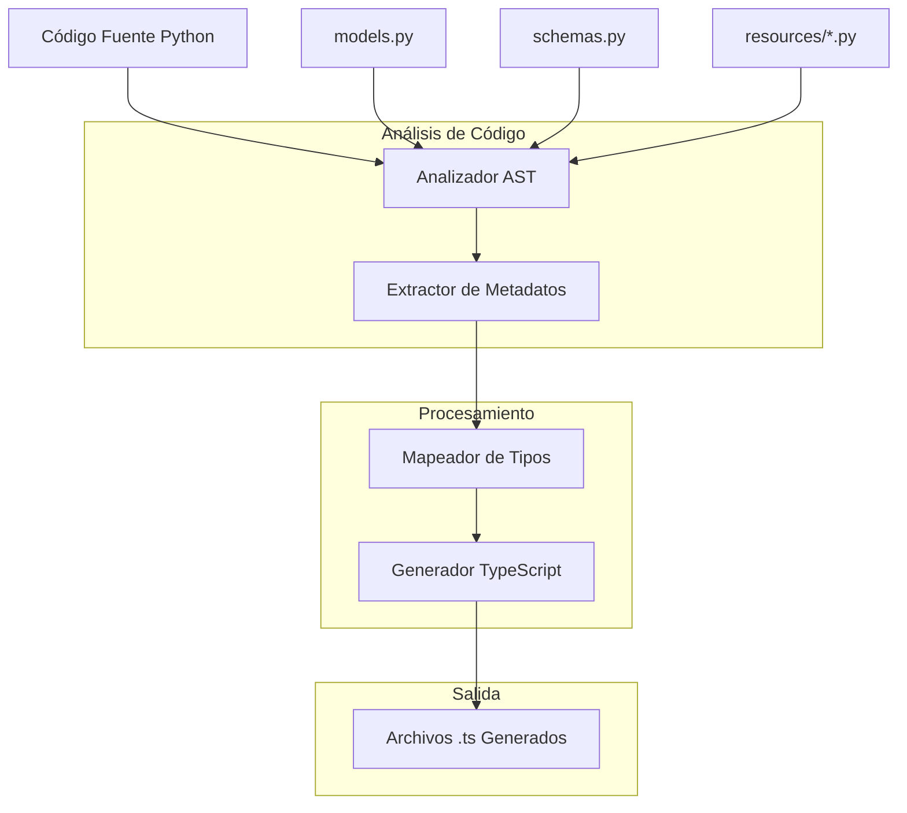
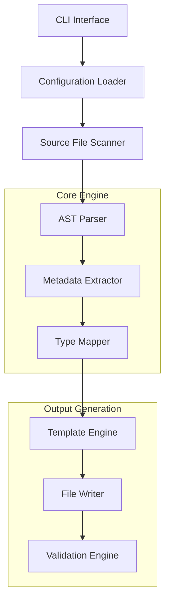
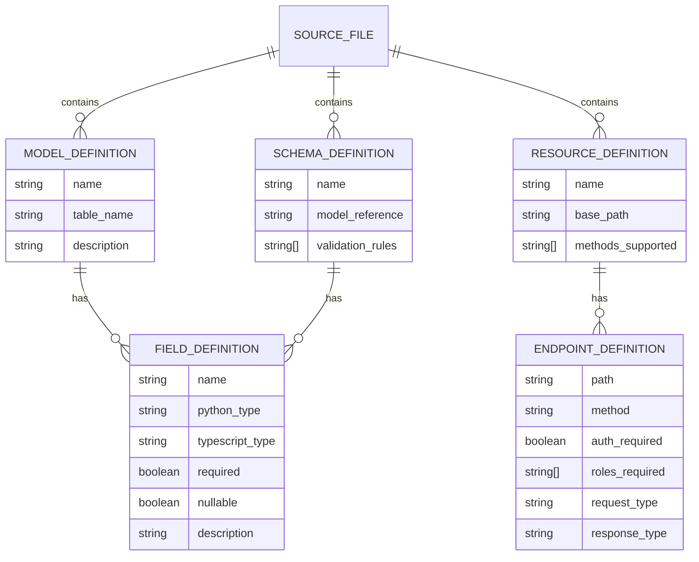

# Arquitectura Técnica - Generador de Tipos TypeScript

## 1. Arquitectura del Sistema



## 2. Descripción de Tecnologías

- **Frontend**: TypeScript + Generación automática de tipos
- **Backend**: Python 3.8+ con análisis AST
- **Librerías principales**:
  - `ast`: Análisis de sintaxis Python
  - `inspect`: Introspección de objetos
  - `jinja2`: Templates para generación de código
  - `typing`: Análisis de tipos Python

## 3. Definiciones de Rutas

| Ruta | Propósito |
|------|---------|
| `/generate` | Script principal para generar tipos |
| `/analyze` | Análisis de código fuente |
| `/validate` | Validación de tipos generados |
| `/watch` | Modo watch para regeneración automática |

## 4. API del Generador

### 4.1 Interfaz Principal

```python
class TypeScriptGenerator:
    def __init__(self, config: GeneratorConfig):
        pass
    
    def analyze_source_files(self) -> SourceAnalysis:
        pass
    
    def generate_types(self, analysis: SourceAnalysis) -> GeneratedFiles:
        pass
```

**Configuración**:
| Parámetro | Tipo | Requerido | Descripción |
|-----------|------|-----------|-------------|
| source_dir | string | true | Directorio del código fuente Python |
| output_dir | string | true | Directorio de salida para tipos TypeScript |
| include_patterns | List[string] | false | Patrones de archivos a incluir |
| exclude_patterns | List[string] | false | Patrones de archivos a excluir |

**Respuesta**:
| Campo | Tipo | Descripción |
|-------|------|-------------|
| success | boolean | Estado de la generación |
| files_generated | List[string] | Lista de archivos generados |
| errors | List[string] | Errores encontrados |

### 4.2 API de Análisis

```python
def analyze_models(file_path: str) -> ModelAnalysis:
    """Analizar models.py"""
    pass

def analyze_schemas(file_path: str) -> SchemaAnalysis:
    """Analizar schemas.py"""
    pass

def analyze_resources(directory: str) -> ResourceAnalysis:
    """Analizar resources/*.py"""
    pass
```

## 5. Arquitectura del Generador



## 6. Modelo de Datos

### 6.1 Definición del Modelo de Datos



### 6.2 Estructuras de Datos Internas

```python
# Definiciones de tipos para el análisis
@dataclass
class FieldDefinition:
    name: str
    python_type: str
    typescript_type: str
    required: bool = True
    nullable: bool = False
    description: Optional[str] = None
    default_value: Optional[Any] = None

@dataclass
class ModelDefinition:
    name: str
    table_name: Optional[str]
    fields: List[FieldDefinition]
    relationships: List[str]
    description: Optional[str] = None

@dataclass
class EndpointDefinition:
    path: str
    method: str
    auth_required: bool
    roles_required: List[str]
    query_params: List[FieldDefinition]
    request_body: Optional[str]
    response_type: str
    description: Optional[str] = None

@dataclass
class ResourceDefinition:
    name: str
    base_path: str
    endpoints: List[EndpointDefinition]
    description: Optional[str] = None

@dataclass
class SourceAnalysis:
    models: List[ModelDefinition]
    schemas: List[SchemaDefinition]
    resources: List[ResourceDefinition]
    enums: List[EnumDefinition]
```

### 6.3 Configuración del Generador

```python
# Configuración principal
@dataclass
class GeneratorConfig:
    source_directory: str
    output_directory: str
    include_patterns: List[str] = field(default_factory=lambda: ["*.py"])
    exclude_patterns: List[str] = field(default_factory=list)
    
    # Opciones de generación
    generate_api_client: bool = True
    generate_mock_data: bool = False
    include_documentation: bool = True
    
    # Mapeo de tipos personalizado
    custom_type_mappings: Dict[str, str] = field(default_factory=dict)
    
    # Configuración de templates
    template_directory: Optional[str] = None
    custom_templates: Dict[str, str] = field(default_factory=dict)

# Mapeo de tipos por defecto
DEFAULT_TYPE_MAPPINGS = {
    'str': 'string',
    'int': 'number',
    'float': 'number',
    'bool': 'boolean',
    'datetime': 'string',
    'date': 'string',
    'UUID': 'string',
    'List': 'Array',
    'Dict': 'Record',
    'Optional': 'null',
    'Union': 'union',
}
```

Este documento define la arquitectura técnica completa para el generador de tipos TypeScript, proporcionando una base sólida para la implementación del sistema que analizará el código Python de la API Flask Manngo y generará automáticamente los tipos TypeScript correspondientes.